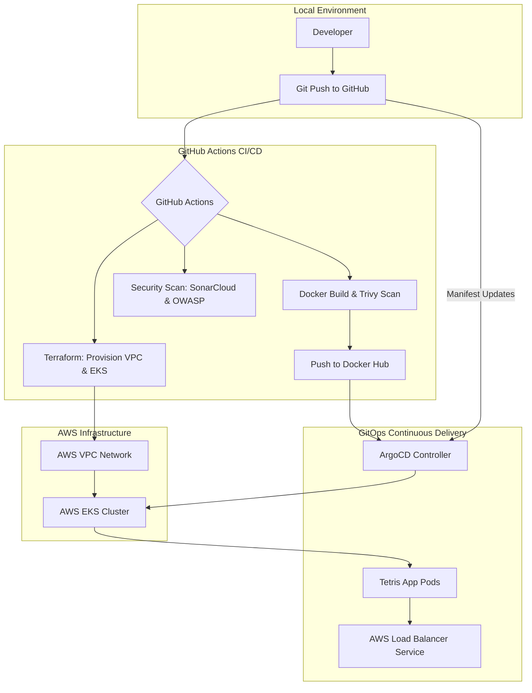

# EKS DevSecOps & GitOps Pipeline

This project demonstrates the implementation of a secure, automated pipeline for deploying a containerized application to an AWS Elastic Kubernetes Service (EKS) cluster using GitOps principles.



## Core Objectives

The following technical milestones were achieved in this project:
- ↳ **Build a full DevSecOps pipeline** around a containerized application.
- ↳ **Integrate CI/CD**, container scanning, and Kubernetes deployment.
- ↳ **Apply security checks** within the pipeline stages.
- ↳ **Deploy and manage workloads** in a Kubernetes cluster using GitOps.

## Technology Stack

| Category | Tool |
| :--- | :--- |
| **Cloud Provider** | AWS (EKS, VPC, S3) |
| **Infrastructure as Code** | Terraform |
| **CI/CD Platform** | GitHub Actions |
| **Static Analysis (SAST)** | SonarCloud |
| **SCA Security** | OWASP Dependency-Check |
| **Container Security** | Trivy |
| **Containerization** | Docker |
| **GitOps Controller** | ArgoCD |

## Pipeline Architecture

The workflow is divided into two primary automation streams:

1. **Provisioning (IaC)**: Terraform scripts automate the creation of a dedicated VPC, Subnets, and the EKS Cluster. This ensures environment consistency and reproducibility.
2. **Application Lifecycle**: GitHub Actions manage the build, security scanning, and registry push. ArgoCD then synchronizes the cluster state with the repository manifests.

## Deployment Guide

### 1. Prerequisites
- An AWS account with appropriate IAM permissions.
- Docker Hub and SonarCloud accounts for image storage and code analysis.
- AWS CLI and kubectl installed locally.

### 2. Required GitHub Secrets
Configure the following secrets in your repository settings:
- `AWS_ACCESS_KEY_ID` & `AWS_SECRET_ACCESS_KEY`
- `SONAR_TOKEN`
- `DOCKER_USERNAME` & `DOCKER_PASSWORD`
- `GH_PAT_TOKEN` (Scope: `repo` and `workflow`)

### 3. Execution
- **Infrastructure**: Trigger the `terraform.yml` workflow or push to the `EKS-TF/` directory.
- **Application**: Push changes to the application source. The `cicd.yml` workflow will handle the build and security validation.
- **GitOps**: Bootstrap ArgoCD in the cluster and apply the application manifest:
  ```bash
  aws eks update-kubeconfig --region us-east-1 --name Tetris-EKS-Cluster
  kubectl create namespace argocd
  kubectl apply -n argocd -f https://raw.githubusercontent.com/argoproj/argo-cd/stable/manifests/install.yaml
  kubectl apply -f Manifest-file/argocd-tetris-app.yaml
  ```

## Infrastructure Management & Cleanup

To decommission the resources and avoid ongoing costs:
1. Remove the ArgoCD application: `kubectl delete -f Manifest-file/argocd-tetris-app.yaml`
2. Destroy infrastructure: `terraform destroy` within the `EKS-TF/` directory.

## License
This project is licensed under the Apache-2.0 license.